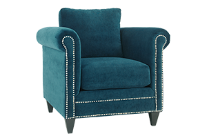
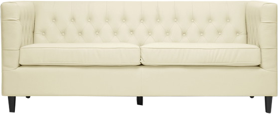

# Room Decorator with jQuery Methods


Now that you're a jQuery selector pro, it's time to dive into jQuery methods. Methods are a pre-defined set of instructions defined in jQuery that the browser can understand and follow. Sometimes you might here the word `function` used in place of `method`. They're synonyms and can be used interchangeably. 

You just moved into a brand new place and it's time to decorate!


## Let's Get Started

### Step 1:

Click `Open` at the top of this page to bring this lesson down so you can edit files in Nitrous.


### Step 2:

Open `index.html` in the browser by running in terminal `python -m SimpleHTTPServer 3000`. 

Once you have the server running, select `preview` and then `port 3000`.


### Step 3:

You're going to code your solution in `js/decorate.js`. Go ahead and open that file in the Nitrous text editor, as well as `index.html`. You shouldn't need to make any changes to `index.html` in order to code your solution. Don't worry about the code in `css/style.css`. All the styling has be written for you, and will work perfectly if you don't change the HTML.

In `js/decorate.js`, we've set up the jQuery selectors and `click` functions for you, but your job is to fill in the rest.

### Step 4:

Take a look at `index.html` in the browser. You should see something like this:


Your job is to write the code that will trigger the actions the buttons take. 

### Step 5:

Let's tackle the `Add Chair` button. When you click this button, you should see the `blue-chair.png` image (located in the images directory) appear on the screen.

If you take a look at `index.html` in the Nitrous text editor, you see a `div` where you'll want the code for the chair to go. 

```html
<div class="blue-chair">
</div>
```

But you're not going to directly edit `index.html` ourselves. Instead, you're going to use the jQuery `append` method. This method does exactly what it seems, it appends, or adds HTML elements to an HTML file. JQuery knows what file to add to based on what HTML file it's linked to. You'll notice that `js/decorate.js` is linked to `index.html` at the bottom of the HTML file.

Because the browser first loads `index.html`, we link our all external files to the HTML file, and not the other way around. At the bottom of `index.html`, you'll see the lines:

```html
<script src="js/decorate.js"></script>
```

The jQuery file (`js/decorate.js`) knows to append any HTML to that particular file. We haven't linked our `js/decorate.js` file to any other HTML files so the jQuery we write will only effect `index.html`.

In this case, we're adding an img tag to index.html

The append method needs one piece of information in order to do its job, what HTML you want to add to the file. In this case, because we want to put an image on the page, we want the follow HTML added to the index file:

```html

```

So now to finish out the jQuery, copy the following code and paste it below the comment `//code solution to put the blue chair in index.html`:

```js
$('.blue-chair').append("");
```

What this code is saying is when you click the HTML element with the ID chair (in this case the button that says `Add Chair`), we'll add the HTML image to the HTML with the class `blue-chair`, which in this case is a `div`. 

Save your changes to `js/decorate.js` and refresh the page in the browser. Click the `Add Chair` button and watch the chair appear!

### Step 6:

Now let's tackle the couch! You're going to follow a very similar pattern as the chair.

You want the couch to appear in the HTML where you see:

```html
<div class="couch">
</div>
```

In this case, you want the following HTML added (or appended) to that div:

```html

```

Copy the following jQuery and paste it in `js/decorate.js` below the comment `//code solution here to put the couch in index.html`:

```js
$('.couch').append("");
```
Altogether, this code allows the user to click the button with the ID `couch`. When that happens, you add the `img` tag inside the `div` with the class `couch`. 

Save your changes to `js/decorate.js` and refresh the page in the browser. Click the `Add Couch` button. Note, you won't see the chair until you click the `Add Chair` button too!

### Step 7:

Now let's tackle the chandelier! You're going to follow the exact same pattern as both the chair and the couch. The HTML for the chandelier image is:

```html

```

You want to put the `img` tag inside the following HTML:

```html
<div class="chandelier">
</div>
```

Which means, when the user clicks the `Add Chandlier` button (the button with the ID `chandelier`), you'll need to use the jQuery append function. Copy the jQuery below and paste it below the comment `//code solution here to put the chandelier in index.html  //code solution here to put the chandelier in index.html`:

```js
 $('.chandelier').append("");
```

Save your changes to `js/decorate.js` and refresh the browser. Try the `Add Chandelier` button. Remember, you'll need to also click the `Add Chair` and `Add Couch` button to put those pieces of furniture back in the room.


### Step 8:

Now let's frame the art on the wall! In order to do this, we want to add some CSS to the image using jQuery.

In `index.html`, the art on the wall is displayed using the following HTML:

```html

```

You'll notice this `img` tag has the ID `art`, which you can use as our selector to apply styling via jQuery. Copy the jQuery below and paste it in `js/decorate.js` below the comment `//code solution here to frame the art on the wall`:

```js
$('#art').addClass('frame-art');
```

This code is using the jQuery method `addClass`. This method needs a little bit of extra instructions, which is what class you want to add to the image with the ID `art`. In this case, the class you're adding is `frame-art`. 

Take a look at `css/style.css`. You'll notice in this file there is a class `frame-art`:

```css
.frame-art{
  border-color: orange;
  border-style: solid;
  border-width: 5px;
}
```

This class has a solid orange border of 5px, which means any HTML tag that has this class will have this border. When you use jQuery to add this class to the image, you'll see the frame!

Save your changes to `js/decorate.js` and refresh the page in the browser. Click `Frame Art` and watch the frame appear! remember to click the first three buttons as well to watch the furniture appear.

### Step 9:

WOW. That's been a lot of work so far. You **MUST** be hungry. Luckily, you bought some pizza before you started decorating to eat later in the day. But first, you need to write the code to actually eat the pizza.

You're going to use the jQuery `toggle` method to hide the pizza. `toggle` will also make the pizza appear again if you click the button (and disappear and reappear ad nauseum every time you click the button).

You'll notice in `index.html`:

```html

```

You can use the ID `pizza` as our jQuery selector to apply to `toggle` method to. Copy the jQuery below and paste it in `js/decorate.js` under the comment `//code solution here to make the pizza disappear and reappear`:

```js
$('#pizza').toggle();
```

Save your changes to `js/decorate.js` and refresh in the browser. Click the `Eat Pizza` button as many times as you want to watch the pizza disappear and reappear.

### Step 10:

You're almost done. But an amazing living room like this isn't complete without a TV. You're going to use the `append` method again to add the TV to the room.

You'll want to add the TV to the following HTML:

```html
<div class="tv">
</div>
```

Copy the jQuery below and paste it in `js/decorate.js` where you see the comment `//code solution here to add the tv to index.html`:

```js
 $('.tv').append("");
```

Save your changes to your file, and refresh the page in the browser. Try clicking `Add TV` to watch the TV appear!

### Step 11 

Now it's time to relax and watch some TV!! So far on the screen, we have a TV with a black screen, so now we need to write some code to replace the TV with the black screen with an image of the TV on.

You're going to use the jQuery `replaceWith` method to achieve this. The replace method needs some extra information in order to do it's job. It needs to know what HTML is doing the replacing, which in this case is the image of the TV on.

Copy the jQuery below and paste it in `js/decorate.js` below the comment `//code solution here to turn the tv on`:

```js
$('.tv img').replaceWith("");
```

Here, you're using the selector `.tv img`, which is selecting an image with the class `tv` and replacing it with the HTML ``. 

Save your changes to `js/decorate.js` and refresh in the browser. Test all the buttons this time. Make sure you click `Add TV` before you click `Watch TV`, and enjoy your new living room!


## Done and Done

Lastly, you need to enter in terminal in Nitrous `learn submit`. This command will push your work to GitHub and mark this lesson as complete in Learn!

## Share Share Share!
Show of your work by taking a screenshot of your filled treasure box or code and share with **\#flatironcodeclub** and **\#jQueryDecorator**

## Reminder 

Don't forget to shut down your server by hitting `control` and `c` before you move on to other material!


